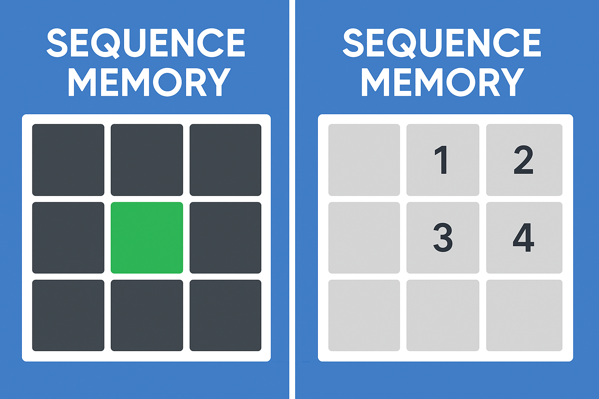

# Brain Games
## Date 30-6-2025

### By: Jawad Hassan
[Linkedin](#) | [Github](#) 

## Description
### Brain Games is a multi Games focuses on memory, Focus, the games  
  #### visual memory: flash for some seconds then you must remember which one flashed  
  #### number sequence memory: same as the visual, but here there is a specific order  
  #### card flip: bunch of cards, each card has two copies then you must remember the right two cards by clicking; if it is correct ok else try again.

## Technology used
1. Program languages
  * JavaScript
  * HTML && CSS

## Getting Strated

### Logic and Function
  #### the nice thing is all 3 games have the same template, if i do one i can do the three

  #### first it starts 3*3 then increase when level becomes more 4*4 5*5 n*n
1. #### i need to know how to create box (n*n) in JS automatically, by Grid
2. #### also this box i need to create class and id automatically at the same time
3. #### two arrays: one is for square index if clicked, and one for affected square (is important in Function compare())
4. ####  3/5 heart for each level before loss
5. #### handlClick ()
6. #### save elements reference  

### Game Start

when user clicks start button ---> Function initializeLevel () {

	- create default box (3*3), but has the ability to change box based on condition like currentLevel
	- create two "" arrays with n*n size, default box is 9
	- affected array by random index
	- each square has the id and class

}

if user clicks any box ---> Function click () {

	save box index in board

call the Function Compare () {

	Compare two arrays if they are equal (effect array === board array)

	if (level finish call the initializeLevel) so it creates new level with new box size (n*n)

} 

}

## Screenshots

